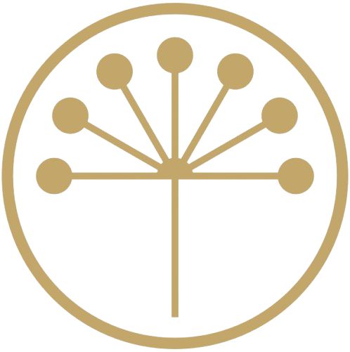

  <b>Башҡортостанда эшләнгән.</b> 
  Made in Bashkortostan.

  <i>The kurai flower — the seven clans from the republic's 
  coat of arms, come together at a single root.</i>

 

---

  Desktop app that deploys your own VPN to your own VPS over SSH. 
  No accounts, no telemetry — credentials and keys never leave your machine.

https://github.com/user-attachments/assets/5a60c565-79a0-41a1-a4c0-616e2d3404a6

## Installation

| Platform              | Download                                                                      |
| :-------------------- | :---------------------------------------------------------------------------- |
| macOS (Apple Silicon) | [`.dmg`](https://github.com/MarselNet86/uplink/releases/latest)               |
| macOS (Intel)         | [`.dmg`](https://github.com/MarselNet86/uplink/releases/latest)               |
| Windows               | [`Setup .exe`](https://github.com/MarselNet86/uplink/releases/latest)         |
| Linux                 | [`.AppImage` / `.deb`](https://github.com/MarselNet86/uplink/releases/latest) |

## Protocols

Both install on port 443 at once and do not conflict — one takes TCP, the other UDP.

**VLESS + Reality** — `443/tcp`. Xray-core. The server borrows the TLS handshake of a real third-party site, so traffic is indistinguishable from an ordinary HTTPS connection to that site. No domain and no certificate needed: the donor site is picked automatically from a built-in list and verified before install.

**Hysteria2** — `443/udp`. QUIC-based, with congestion control that holds up on lossy and long-haul links where TCP collapses. Gets a real Let's Encrypt certificate on a free `sslip.io` domain derived from the server address, so no domain purchase is needed either.
